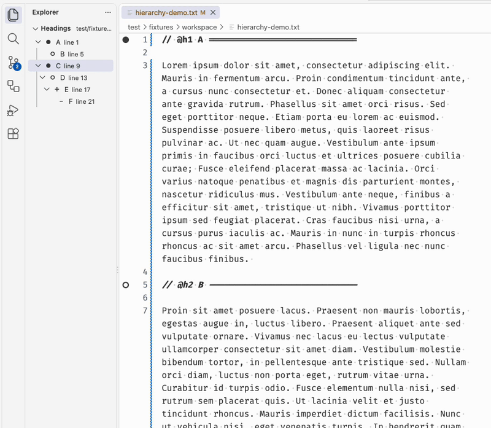

# Tiered Headings Navigator

A Visual Studio Code extension that turns user-defined inline markers into a
navigable, foldable heading hierarchy. Processing stays local, with no telemetry
or network requests.

## Demo



## Features

- Build a Markdown-style hierarchy from literal markers such as `@h1`, `@h2`,
  and `@h3`.
- Navigate from the **Headings** tree and follow the active editor cursor.
- Update immediately as unsaved headings are added, renamed, or reorganized.
- Add native editor folds, with optional one-way tree-to-editor fold syncing.
- Customize labels and bold or italic styles, with fixed level-specific gutter
  symbols.

## Quick start

Add trigger definitions to VS Code settings:

```json
{
  "tieredHeadings.triggers": [
    {
      "snippet": "@h1",
      "level": 1,
      "labelRegex": {
        "pattern": "\\s+[-=]+\\s*$",
        "replacement": ""
      }
    },
    {
      "snippet": "@h2",
      "level": 2
    },
    {
      "snippet": "@h3",
      "level": 3
    }
  ]
}
```

Then place the markers anywhere in a text document:

```text
## @h1 Introduction -----------------
// @h2 Installation
// @h3 Requirements
// @h2 Usage
```

Run **Tiered Headings: Show Headings** from the Command Palette. Click a tree
item to reveal its marker in the editor.

Trigger matching is literal and case-sensitive by default. Smaller level numbers
represent higher tiers, and missing intermediate levels do not create placeholder
nodes.

## Labels

The default label is the trimmed text after the matched trigger. `labelTemplate`
can also use these placeholders:

| Placeholder | Value |
| --- | --- |
| `${after}` | Text after the trigger |
| `${before}` | Text before the trigger |
| `${line}` | Complete source line |
| `${trigger}` | Matched trigger text |
| `${lineNumber}` | One-based line number |

### Remove variable separators with a regex

The `labelRegex` in the quick-start example converts:

```text
## @h1 This is the title -----------------
```

to **This is the title**. The pattern `\s+[-=]+\s*$` removes whitespace followed
by any positive number of trailing dashes or equals signs. Backslashes are
doubled in JSON. Copy the same `labelRegex` onto each trigger level that uses
this presentation.

Regex replacement is applied once to `${after}` before `labelTemplate`.
JavaScript replacements such as `$1` and `$<name>` are supported. A non-match
leaves the original text unchanged; invalid configuration leaves the literal
trigger active without the replacement.

Regex labels are disabled in VS Code Restricted Mode until the workspace is
trusted. In trusted workspaces, use anchored, specific expressions and avoid
ambiguous nested quantifiers that can be slow in JavaScript.

### Exact delimiters

For exact surrounding markers, use literal delimiters instead:

```json
{
  "snippet": "@h2",
  "level": 2,
  "labelDelimiters": {
    "start": "[[",
    "end": "]]"
  }
}
```

`@h2 [[ Installation ]]` is displayed as **Installation**. Delimiters must both
match and cannot be combined with `labelRegex` on the same trigger.

## Navigation and folding

While the **Headings** view is visible, its selection follows the section
containing the primary cursor without taking editor focus. A hidden view remains
hidden and catches up when reopened.

Native heading folding is enabled by default. A folded heading remains visible
while its section is hidden. Set `tieredHeadings.folding.syncFromNavigator` to
`true` to mirror parent-row collapse and expand actions into the editor. This is
one-way: editor-originated folding does not alter the tree.

Provider-based folding requires VS Code's `editor.folding` setting and the
`auto` folding strategy.

## Settings

| Setting | Default | Purpose |
| --- | --- | --- |
| `tieredHeadings.triggers` | `[]` | Defines literal markers, levels, and labels |
| `tieredHeadings.caseSensitive` | `true` | Controls trigger matching |
| `tieredHeadings.gutter.enabled` | `true` | Shows level symbols in the gutter |
| `tieredHeadings.folding.enabled` | `true` | Provides heading-derived folds |
| `tieredHeadings.folding.syncFromNavigator` | `false` | Mirrors tree folding into the editor |
| `tieredHeadings.editor.levelStyles` | Levels 1–3 styled | Configures whole-line font styles |

Level styles support `normal`, `bold`, `italic`, and `boldItalic`. Use an empty
array to disable heading text styling.

## Development

Requires Node.js 22 or newer and desktop VS Code 1.75 or newer.

```sh
npm install
npm run verify
npm run vsix
```

Press **F5** to launch an Extension Development Host. See
[`PRODUCT_SPEC.md`](PRODUCT_SPEC.md) for product rules and
[`TESTING.md`](TESTING.md) for manual checks.

Workspace-wide indexing, browser-based VS Code, regex trigger matching, and
Marketplace publication are currently outside scope.

## Development disclosure

This project was generated with LLM coding tools under the maintainer's
direction. It has not received a complete independent human audit for
correctness, security, provenance, or license compliance.

The extension was inspired by tintinweb's
[Inline Bookmarks](https://github.com/tintinweb/vscode-inline-bookmarks) and was
implemented independently.

## License

[MIT](LICENSE)
